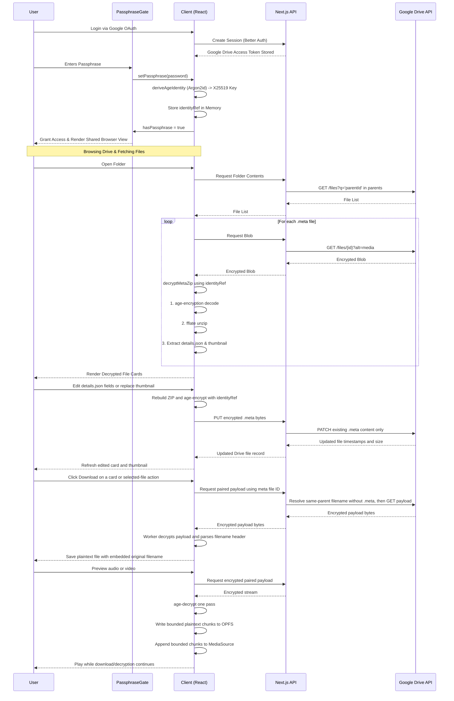

# Architecture & Decryption Flow

The Encrypted GDrive project acts as a secure, zero-knowledge overlay on top of Google Drive. By strictly separating storage (Google Drive), proxying (Next.js), and cryptography (Browser), the system ensures that sensitive data is never exposed unencrypted on any server.

## High-Level Architecture

1. **Frontend (Client-Side)**: React 19 application running in the browser. It handles state management, local/recursive/global search, and strictly executes all cryptographic operations (`age-encryption` and `fflate`) in memory.
2. **Backend (Proxy/Auth Layer)**: Next.js API Routes. It manages OAuth sessions using Better Auth (persisting session data locally in SQLite) and acts as a secure proxy. It attaches the user's Google Drive OAuth token to fetch and replace encrypted blobs in the Google Drive API.
3. **Storage Layer (Google Drive API)**: The actual Google Drive servers where files are stored. The data stored here consists of opaque folders, numbered age-encrypted payloads, and `.meta` files (age-encrypted metadata zip archives). A payload is paired with a `.meta` file by sharing its folder and using the `.meta` filename without the final suffix.

## Shared Client Architecture

The current frontend separates page-specific data discovery from shared file-browsing and decryption behavior:

1. **Fetch Helpers**: `lib/drive-client.ts` centralizes client-side calls for breadcrumbs, subfolders, and `.meta` file lists.
2. **View Shell**: `components/drive-file-browser.tsx` owns the shared file toolbar, inline search, sorting, refresh button, empty states, and `MetaGrid` rendering.
3. **Prompt Handling**: `components/decryption-error-dialog.tsx` and `hooks/use-decryption-error-prompt.ts` own the wrong-passphrase / stop / re-enter flow for both normal and recursive pages.
4. **Decryption Helpers**: `lib/meta-decryption.ts` centralizes the shared worker/decrypt/update helpers used by `useMetaFiles` and `useRecursiveMetaFiles`.
5. **Download Pipeline**: `components/file-download-provider.tsx` resolves encrypted payloads through the authenticated API, passes the response body through age stream decryption, validates the small CLI-compatible filename header, and writes plaintext chunks directly to disk when the browser supports the File System Access API.
6. **Metadata Edit Pipeline**: `MetaDetailModal` edits the in-memory `details.json` object and thumbnail bytes, `lib/crypto.ts` creates a new ZIP and age ciphertext in the browser, and `PUT /api/drive/meta/[fileId]` replaces only the existing `.meta` file content through the authenticated Drive API.
7. **Upload Pipeline**: `UploadModal` creates the small encrypted `.meta` sidecar first. The original is then read from `File.slice()` in bounded chunks, given the same CLI filename header, age-encrypted locally, and sent with a Drive resumable upload. Drive sees only opaque numeric `<id>.meta` and `<id>` names.
8. **Media Preview Pipeline**: Audio/video previews consume the payload's one-pass decrypted stream once. Each plaintext chunk is written at its offset to an origin-private OPFS temporary file and appended to a `MediaSource` buffer. The browser never assembles the original in JavaScript memory. If MSE evicts a range, the player rebuilds the buffer by reading bounded chunks back from OPFS. Unsupported codecs fall back to the normal download action.

## Data Flow: Google OAuth to Decryption

To access files, the user must first authenticate with Google OAuth, then provide a local encryption passphrase.

### System Interaction Mermaid Flow

## Security Guarantees
- The passphrase is never transmitted to the server or Google Drive.
- Metadata saves send only age-encrypted `.meta` bytes to the server. The server never receives plaintext `details.json`, thumbnail bytes, or the derived identity.
- Metadata saves update the existing `.meta` file's content only. The paired original payload and all Google Drive file naming/parent metadata remain untouched.
- The `identityRef` derived from the passphrase is held strictly in memory and clears on reload or when the key is explicitly replaced or cleared.
- The `.meta` blobs and payloads stored in Google Drive are completely opaque. Metadata is a zip containing JSON and thumbnails, while payloads contain a filename header and file bytes; both are encrypted using `age-encryption`.
- Original-file downloads fetch encrypted payload bytes through the server proxy, but age decryption, filename parsing, and plaintext Blob creation all happen in the browser. Plaintext is not sent back to the server.
- Better SQLite3 is used locally purely for Better Auth session management (if the Next.js app is hosted), keeping OAuth tokens secure.
- Media preview plaintext is temporarily cached in the browser's origin-private file system so seeking and MSE replay are possible. The cache contains only opaque Drive IDs, is never uploaded, is removed on vault lock or when manually cleared, and expires after two hours of inactivity. This is a deliberate usability tradeoff: previews require trusting the unlocked browser profile during that period.

## Search Pipeline

Because Google Drive only sees encrypted `.meta` blobs, searching requires local decryption:
1. When folders are browsed, the client decrypts `.meta` files and caches the output in React Query.
2. The normal folder view and recursive search view both reuse the same local browser shell for search, sorting, refresh, and `MetaGrid` rendering.
3. The recursive search page first crawls subfolders client-side, fetches each folder's `.meta` list, then feeds the aggregated file set into the same decryption/render pipeline used by the normal folder page.
4. The `GlobalSearchModal` utilizes `Fuse.js` to execute real-time, space-insensitive fuzzy matching across the decrypted React Query memory cache.
