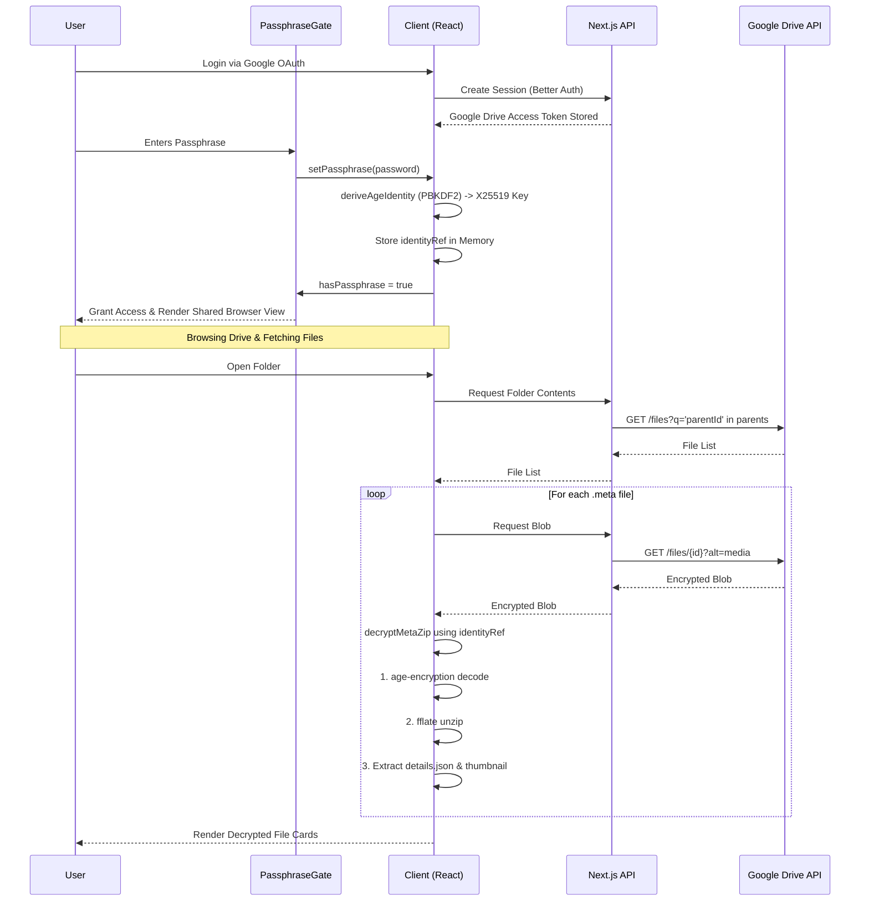

# Architecture & Decryption Flow

The Encrypted GDrive project acts as a secure, zero-knowledge overlay on top of Google Drive. By strictly separating storage (Google Drive), proxying (Next.js), and cryptography (Browser), the system ensures that sensitive data is never exposed unencrypted on any server.

## High-Level Architecture

1. **Frontend (Client-Side)**: React 19 application running in the browser. It handles state management, local/recursive/global search, and strictly executes all cryptographic operations (`age-encryption` and `fflate`) in memory.
2. **Backend (Proxy/Auth Layer)**: Next.js API Routes. It manages OAuth sessions using Better Auth (persisting session data locally in SQLite) and acts as a secure proxy. It attaches the user's Google Drive OAuth token to fetch encrypted blobs from the Google Drive API.
3. **Storage Layer (Google Drive API)**: The actual Google Drive servers where files are stored. The data stored here consists of opaque folders and `.meta` files (which are age-encrypted zip archives).

## Shared Client Architecture

The current frontend separates page-specific data discovery from shared file-browsing and decryption behavior:

1. **Fetch Helpers**: `lib/drive-client.ts` centralizes client-side calls for breadcrumbs, subfolders, and `.meta` file lists.
2. **View Shell**: `components/drive-file-browser.tsx` owns the shared file toolbar, inline search, sorting, refresh button, empty states, and `MetaGrid` rendering.
3. **Prompt Handling**: `components/decryption-error-dialog.tsx` and `hooks/use-decryption-error-prompt.ts` own the wrong-passphrase / stop / re-enter flow for both normal and recursive pages.
4. **Decryption Helpers**: `lib/meta-decryption.ts` centralizes the shared worker/decrypt/update helpers used by `useMetaFiles` and `useRecursiveMetaFiles`.

## Data Flow: Google OAuth to Decryption

To access files, the user must first authenticate with Google OAuth, then provide a local encryption passphrase.

### System Interaction Mermaid Flow

## Security Guarantees
- The passphrase is never transmitted to the server or Google Drive.
- The `identityRef` derived from the passphrase is held strictly in memory and clears on reload or expiration.
- The `.meta` blobs stored in Google Drive are completely opaque. They are standard zip files containing JSON metadata and thumbnails, but the entire zip archive is encrypted using `age-encryption`.
- Better SQLite3 is used locally purely for Better Auth session management (if the Next.js app is hosted), keeping OAuth tokens secure.

## Search Pipeline

Because Google Drive only sees encrypted `.meta` blobs, searching requires local decryption:
1. When folders are browsed, the client decrypts `.meta` files and caches the output in React Query.
2. The normal folder view and recursive search view both reuse the same local browser shell for search, sorting, refresh, and `MetaGrid` rendering.
3. The recursive search page first crawls subfolders client-side, fetches each folder's `.meta` list, then feeds the aggregated file set into the same decryption/render pipeline used by the normal folder page.
4. The `GlobalSearchModal` utilizes `Fuse.js` to execute real-time, space-insensitive fuzzy matching across the decrypted React Query memory cache.
